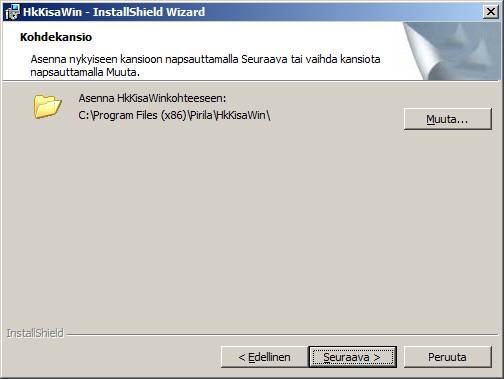
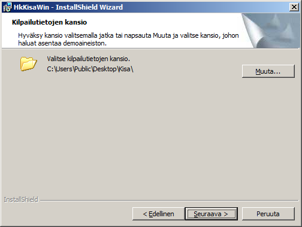
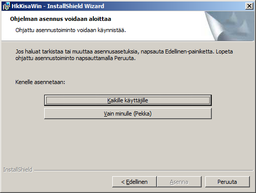

# Asennuksen vaiheet

Ohjelmiston asennusohjelmaa käytettäessä voidaan tehdä
valintoja seuraavissa kolmessa vaiheessa (Esimerkkitapaus kuvaa asennusta englanninkieliseen 64-bittiseen Windows 7 -versioon käyttäjätunnuksen
ollessa Pekka.):

Yllä näkyvässä vaiheessa ohjelma ehdottaa kohdetta,
johon ohjelmat tullaan asentamaan. Myöhemmin kolmannessa vaiheessa tehtävä
valinta voi kuitenkin muuttaa kohteen toiseksi kuin, mitä ohjelma tässä esittää.
Normaalisti on hyvä asentaa ohjelmat sinne, minne asennusohjelma haluaa ne
sijoittaa.

Yllä näkyvässä vaiheessa ohjelma ehdottaa
sijoituspaikkaa kilpailutiedoille ja kaikille muille tiedostoille, joita
asennetaan itse ohjelmien lisäksi. Tässä esimerkissä tiedostot asennetaan
englanninkileisen Windows 7:n yhteiselle työpöydälle. Yhteiseen työpöytään
viittaa sana *Public.* On mahdollista, että voimassa oleva käyttöoikeudet
eivät salli tätä asennuskohdetta, jolloin se on vaihdettava, joko näppäimen
*Muuta* kautta hakemalla tai kirjoitamalla sellainen osoite, jonka käyttö
on sallittua. Oma työpöytä, johon päästään vaihtamalla sanan *Public*paikalle oma käyttäjätunnus, on yksi hyvä vaihtoehto.

Myös tässä vaiheessa on otettava huomioon
käyttöoikeudet. Valinta *Kaikille käyttäjille* vaatii
järjestelmänvalvojan oikeudet, joten *Vain minulle* onnistuu helpommin.
Valinta *Vain minulle* johtaa usein myös siihen, että ohjelmien
sijoituspaikka muuttuu automaattiseksi toiseksi kuin yllä ensimmäisessä kuvassa
esitetty.

Ohjelma tekee asennuksen yhteydessä myös ohjelman
*HkKisaWin* pikakuvakkeet menuun sekä että työpöydälle ja ohjelman
*HkMaali* pikakuvakkeen kansion *Kisa* alikansioon
*HkMaaliData*. Tämän pikakuvakkeen käynnistyskansio on sama kuin sen
sijoituspaikka. Ohjelman *HkKisaWin* pikakuvakkeiden käynnistyskansio on
yllä toisessa vaiheessa valittu kansio.