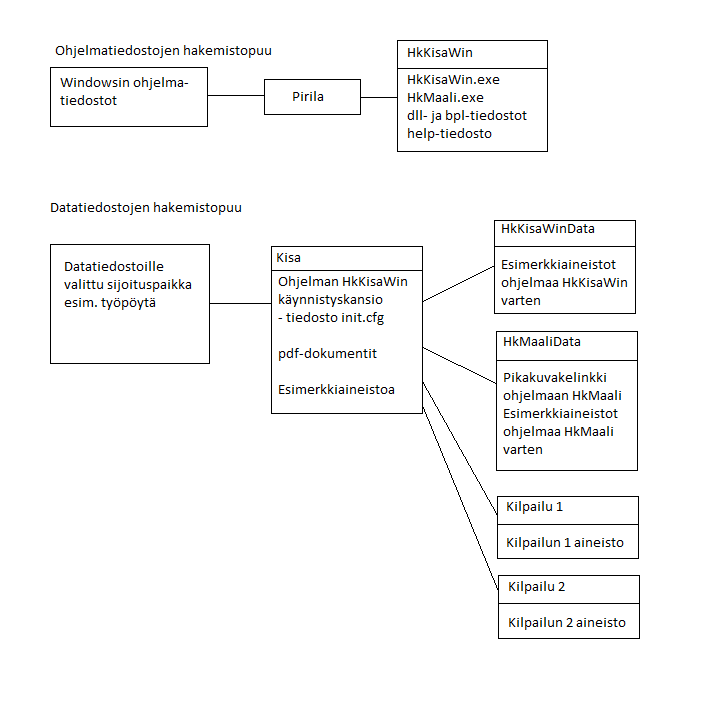

# Kansiorakenne

Ohjelmien käyttämille muille tiedostoille kannattaa
luoda selkeä kansiorakenne. Asennusohjelma ehdottaa tämän pohjaksi työpöydälle
luotavaa kansiota *Kisa.* Kansio voidaan valita
sijoitettavaksi myös muualle, esimerkiksi C:-levyn alimmalle tasolle kansioksi
*C:\Kisa*
tai käyttäjän
omalle tiedostoalueelle. On mahdollista, että käyttäjän oikeudet eivät salli
kansion *Kisa* luomista asennusohjelman ehdottamaan paikkaan, jolloin
valintaa on muutettava ennen, kuin asennus onnistuu. Esimerkiksi yleisen
työpöytälinkin vaihtaminen käyttäjäkohtaiseen voi auttaa (kansion hakemistopolun
*Public* tai vastaava ilmaisu on korvattava tällöin käyttäjän omalla
käyttäjätunnuksella).

Suosittelen joka tapauksessa käyttämään näin luotavaa
kansiota runkona muille kilpailutietoa sisältäville kansioille. Asennusohjelma
luo kansioon *Kisa* kaksi alikansiota *HkKisaWinData* ja
*HkMaaliData*. Nämä kaksi alikansiota sisältävät
esimerkkiaineistoa ja ohjelmien päivitttäminen saattaa kopioida näihin
kansioihin esimerkkiaineistot uudelleen. Siksi ei näitä alikansioita pidä
käyttää käyttäjän omien tiedostojen sijoituspaikkana, vaan omille tiedostoile on
luotava vastaavat alikansiot, mikä voi tapahtua myös ohjelmasta
*HkKisaWin*
käsin, kun luodaan uusi kilpailu.

Yllä olevassa kuvassa viittaavat *Kilpailu 1* ja
*Kilpailu 2* kansioihin, joita asennusohjelma ei luo, vaan jotka
sisältävät käyttäjän myöhemmin luomien kilpailujen aineistoa.