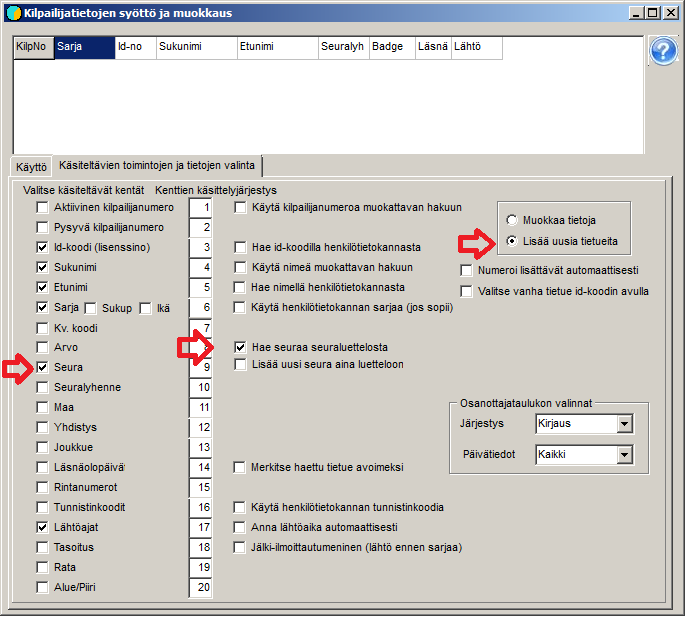

# Ilmoittautumisten syöttö käsin

Pikkutapahtumassa syötetään usein kaikki osanottajat suoraan tulospalveluohjelmaan näppäilemällä tiedot
osanottaja kerrallaan. Tämä tapahtuu kaavakkeella *Kilpailijatietojen syöttö
ja muokkaus,* johon päästään valinnasta *Osanottajat /
Ilmoittautumiset.*

Kaavake saattaa aueta niin, että sillä näkyy teksti
*Muokkausmoodi.* Tämä toimintatila sopii käytettäväksi, kun
kilpailijatietoihin on ennalta luotu vakanttipaikkoja, jotka muokataan
osanottajiksi. Jos halutaan lisätä uusia tietueita, on valittava käyttöön
*Lisäysmoodi.* Moodi vaihdetaan alisivulla *Käsiteltävien toimintojen
ja tietojen valinta*, jolla voidaan myös valita, mitä kaikkia kenttiä pääsee
käsittelemään sekä käyttääkö ohjelma syötön yhteydessä apuna mahdollisten
osanottajien luetteloa tai seuraluetteloa. (Useita muitakin
valintamahdollisuuksia on.)

Käytettäessä kaavaketta ilmoittautumisten syöttöön ennen
myöhempää arvontaa ei ole tarpeen antaa kilpailijanumeroa eikä lähtöaikaa. Jos
osanottajia lisätään tapahtuman aikana, on
ainakin numeron antaminen välttämätöntä, jotta ohjelma voisi tallentaa tiedot. Sarjan
valinta on aina välttämätöntä ohjelman toiminnan kannalta, muut tiedot
syötetään tarpeen mukaan. Seuraluettelon käyttö antaa mahdollisuuden valita
seura vaivattomastio ja auttaa saamaan seuranimet virheettöminä. Kun ruksataan *Hae seuraa
seuraluettelosta* aukeaa
seuraluettelokaavake, josta on valittava
avattavaksi käytettävä seuraluettelo (esim.  Seurat.csv).
Kun sitten syötetään seuran nimeä ja painetaan Enter valinnan
osuttua seuraluettelossa oikealle kohdalle, siirtyy seuranimi luettelon mukaisena ja samalla
myös aluekoodi, vaikka tätä ei olisi valittu näytettäviksi
ilmoittautumiskaavakkeella.

Kaavakkeen yläosan taulukon merkitys on lähinnä näyttää
viimeksi tallennettu tieto, joka voidaan siitä palauttaa korjattavaksi, kun
toimintamoodiksi on valittu *Muokkaa tietoja.*