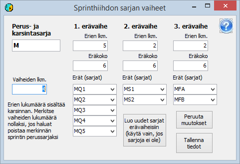

# Sprinthiihdon sarjatiedot

Hiihdon sprint-kilpailu käsitellään 2-4 -vaiheisena
kilpailuna, jonka ensimmäinen vaihe on karsinta (ns. aika-ajo) ja viimeinen
loppukilpailu. Välissä voi olla yksi tai kaksi erävaihetta (neljännesfinaali ja
semifinaali). Parhaiten on esivalmisteltu ratkaisu,
jossa neljännesfinaaleja on 5 tai 4, kummassakin semifinaalissa
vastaavasti 6 tai 4 kilpailijaa ja loppukilpailuina A- ja B-finaali.

Kilpailu on perustettava sisältämään tarvittava
määrä vaiheita, siis täysimittaisessa sprintissä
neljä vaihetta. Kilpailu on määriteltävä käyttämään
vaihtelevia sarjoja ja myös vaihtelevia rintanumeroita, ellei rintanumeroita pidetä muuttumattomina.

Kukin erävaiheen erä käsitellään ohjelmassa
omana sarjanaan. Kaikki tarvittavat sarjat voidaan muodostaa vaivattomasti määrittelemällä ensin
vain perussarja, jota käytetään ilmoittautumisten
kirjaamiseen ja karsinnan sarjana, ja valitsemalla sitten,
että kyseessä on sprinthiihdon perussarja. Tällöin aukeaa alla oleva kaavake

Kun tällä kaavakkeella annetaan vaiheiden lukumäärä,
ehdottaa ohjelma kunkin erävaiheen erien lukumäärää ja eräkokoa. Ohjelman
ehdottamia arvoja voi muuttaa. Ellei erävaiheen sarjoja ole jo määritelty, luo
ohjelma sarjat painikkeen *Luo uudet sarjat erävaiheisiin*
avulla.

Sarjamäärityksissä on perussarja säilytettävä kaikki
vaiheet sisältävänä, vaikka sitä käytetäänkin varsinaisesti vain
karsintavaiheessa. Muuten ohjelma ei tee kaikkia sprinthiihdon toimia oikein.
Kukin erävaiheen sarja määritellään vain kyseisen vaiheen sarjaksi.

Sarjatiedoissa on syytä määritellä kaikille erille likimääräinen lähtöaika niin, että
todellinen lähtö ei tapahdu ainakaan ennen tätä lähtöaikaa, koska
nin saadaan sijoitukset heti oikein, vaikka erän lähtöaika ei
jostain syystä kirjautuisi.

Kaikki kilpailijat kirjataan alun perin karsinnan
mukaiseen sarjaan, joka jää pysyvästi sekä perussarjaksi että karsintavaiheen
sarjaksi. Muiden vaiheiden sarjat tulevat vaihtumaan niiden osalta, jotka
näihin vaiheisiin osallistuvat.

Rintanumerot vaihtuvat sprintissä
yleensä siirryttäessä karsinnasta seuraavaan vaiheeseen. Eri sarjoissa ei
voida käyttää samoja numeroita samassa vaiheessa, mutta sama numero voi olla
yhdellä kilpailijalla karsinnassa ja toisella myöhemmissä vaiheissa.
Tyypillisesti määritellään alkunumerot perussarjalle karsinnassa käytettävän
numeroinnin mukaan ja ensimmäiselle erävaiheelle niin, että sama numero ilmoitetaan kaikille saman sarjan
erille. Myöhemmille vaiheille jätetään alkunumeroksi 0. Jos koko kisassa
käytetään samoja numeroita, merkitään myös ensimmäiseen erävaiheeseen alkunumeroksi
0.

---

 Copyright 2012, 2015 Pekka
Pirilä