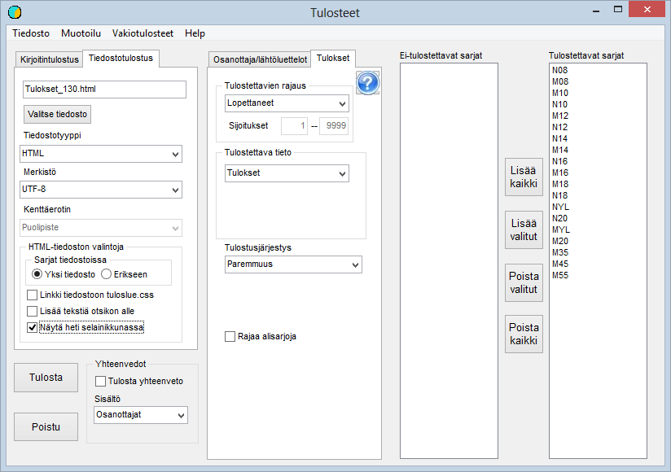

# Tulosluettelot

Päävalikon valinnasta *Tulosteet* voidaan avata tämä kaavake (kuvan sarjat
vastaavat suunnistuskilpailua)

Esimerkkitapauksessa on kaavakkeen avaamisen jälkeen
valittu *Vakiotulosteet / Kaikki lopettaneet html-tiedostoon*. Lisävalinta on johtanut kaikkien sarjojen valitsemiseen
tulostettaviksi. Tulostettavan tiedoston nimi on määräytynyt kilpailulle
annetusta koodista *Tulokset\_130.html.*

Esimerkissä on ruksattu pyyntö näyttää tulosluettelo
heti selainikkunassa, mikä on helppo tapa varmistaa, että tiedosto on
sisällöltään haluttu.

Toinen monissa tapauksissa hyödyllinen valinta pyytää
sijoittamaan tekstiä otsikon alle. Kun tämä on valittu, avaa ohjelma
valintaikkunan mahdollisen aiemman tiedoston lukemiseksi lisättäväksi tekstiksi
tai sen pohjaksi. Sitten avautuu muokkausikkuna, jossa tekstiä voi muokata tai
kirjoittaa täysin uusia kommentteja. Kirjoittamalla sopivia html-koodeja saa
mukaan myös kuvia ja linkkejä muualle, mutta tämä edellyttää html:n alkeiden
osaamista.

Alasvetovalikoista voidaan tehdä monia muitakin
valintoja ja tiedoston sijasta voidaan tulostaa kirjoittimelle, joka on
valittavissa Windowsin kyseisellä koneella tunnistamien kirjoittimien joukosta.
Kirjoitinten listalla saattaa olla myös mahdollisuus tehdä pdf-tiedosto tuloksista.

Valinnasta muotoilu pääsee muuttamaan laadittavan
tulosluettelon muotoilua, jos oletukset eivät sovi.

Kun sarjoista vain yksi tai muutama halutaan tulostaa,
voidaan ne valita kaksoisklikkaamalla sarhan nimeä tai valitsemalla nimi ja
käyttämällä painiketta.

Useimpien tekstitiedostojen osalta ohjelman oletuksena
on UTF-8-koodaus, joka on tulossa yhä selvemmin valta-asemaan. Toistaiseksi voi
siitä kuitenkin tulla ongelmia, jotka ratkeavat vaihtamalla merkistöksi ISO-8859-1.

**Tulostiedosto Hiihtoliitolle**

Rankikilpailuilta edellytettävän tulostiedoston
kirjoittaminen tapahtuu valitsemalla tiedostomuodoksi
*SHL-tulostoimitusmuoto.*  Aiemmasta käytännöstä
poiketen laaditaan tämä tiedosto nykyisin täydellisenä sisältämään kaikki
kilpailuun ilmoittautuneet. Sarjoja ei myöskään yhdistetä. Tiedoston laatiminen
sujuu parhaiten, jos sarjojen nimet ja matkat on määritelty sarjatiedoissa
Hiihtoliiton tuoreimpien ohjeiden mukaisesti.

Täten sarjanimet ovat kolmimerkkisiä (sukupuoli ja
ikäsarja, joka voi olla myös YL). Siis esimerkiksi MYL tai N08.

Matkat ilmoitetaan yhdellä desimaalilla ja liittäen heti
perään hiihtotavan tunnus P, V tai näiden yhdistelmä PV tai VP. Siis esimerkiksi
10.0P tai 15.0PV.

Jos sarjat on varmasti määritelty ohjeiden mukaisesti,
voidaan säästää vaivaa ruksaamalla kenttä Ohita matkan/lajin vahvistus. Muussa
tapauksessa on jokainen matka ja tapa vahvistettava.

Valitaa Yhdistä sarjoja rankisarjoihin ei nykykäytännön
mukaan pidä tehdä, vaan sarjat on jätettävä kilpailun mukaisiksi. Hiihtoliitto
toteuttaa rankiin tarvittavat yhdistämiset matkan ja ikäsarjan perusteella.