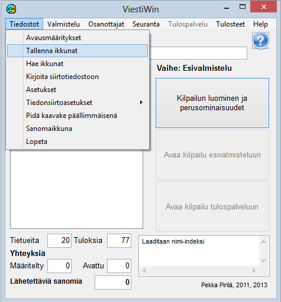

# 1.3.1 Valinta: Tiedostot

Valinta *Tiedostot* avaa seuraavan
alivalikon.

Vaihtoehtojen kautta pääsee seuraaviin toimintoihin:

- **Avausmääritykset**. Ohjelman
  seuraavan käyttökerran käynnistystavan määrittely. Täten saadaan ohjelma
  avautumaan suoraan haluttuun kilpailuun.

  - **Tallenna ikkunat.** Tallentaa
    ohjelman tallennushetkellä käytössä olevien ikkunat, mikä tekee mahdolliseksi
    avata ohjelma jatkossa monelta osin samaan tilaan.

    - **Hae ikkunat.** Ota käyttöön
      valinnassa *Tallenna ikkunat* tallennettu toimintatila.

      - **Kirjoita siirtotiedostoon.**Kilpailua koskevien tietojen kirjoittaminen
        tekstitiedostoihin (csv tai xml), MySQL-tietokantaan tai ajan tasalla olevaan kopioon
        käytössä olevasta tiedostosta KILP.DAT.

        - **Asetukset.** Tärkein toiminto on
          tällä hetkellä mahdollisuus lukea kilpailun aikana VIP-osanottajien
          värikorostusta ohjaava tiedosto korostus.lst.

          - **Vertailuajat.** Emitväliaikojen
            analysointia ohjaavien parametrien määrittely.

            - **Tiedonsiirtoasetukset.**

              - **Asetukset ja
                uusinta.**Yhteyksien sulkeminen ja uudelleenavaaminen, aiemmin
                lähetettyjen sanomien lähettäminen uudelleen.

                - **Tiedonsiirtotiedoston tarkastelu.**
                  Tiedoston COMFILE.DAT sisällön tarkastelu. Täten on mahdollista selvittää,
                  mitä tulospalvelussa on eri vaiheissa tapahtunut.- **MySQL.** Tietokantayhteyden
                määrittely ja mahdollinen avaaminen jatkuvasti toimivaksi. Kertasiirto
                käynnistetään valinnassa *Kirjoita siirtotiedostoon.*

                - **Sanomaikkuna.** Avaa erillinen
                  ikkuna, joka sisältää samat ilmoitukset kuin pääkaavakkeen oikean alakulman
                  ikkuna.

                  - **Kilpailuluettelo.**
                    Kilpailu- tai kuntotapahtumasarjan määrittely helpottamaan tai automatisoimaan myöhempää
                    valintaa.

                    - **Lopeta.** Sulje ohjelma. (Sama
                      vaikutus kuin kaavakkeen oikean yläkulman
                      sulkemisruudulla.)