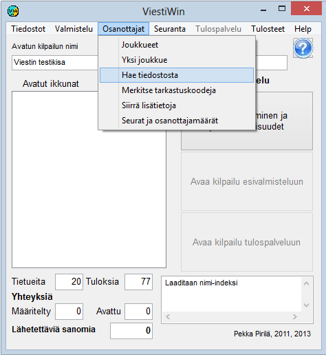

# 1.3.3 Valinta: Osanottajat

Päävalikon valinnasta *Osanottajat* käynnistetään osanottajiin
liittyviä toimintoja, joita voidaan pääosin käyttää sekä esivalmistelussa että
tulospalvelutilassa.

- **Osanottajat.** Taulukko
  osanottajatietojen tarkasteluun ja muokkaamiseen. Taulukosta pääsee
  klikkaamalla edelleen yksittäisen osanottajan tietojen
  kaavakkeelle.

  - **Yksi osanottaja.** Suora linkki yhden
    osanottajan tietojen kaavakkeelle.

    - **Ilmoittautumiset.** Ilmoittautumisten
      syöttö ja muokkaus näppäimistöltä. Käytetään kilpailijatietojen syöttämiseen,
      kun niitä ei lueta tiedostosta. Valinta *Yksi osanottaja* sopii
      paremmin jo syötettyjen tietojen korjaamiseen.

      - **Hae tiedostosta.** Osanottajatietojen
        lukeminen tekstitiedostoista, kuten suunnistuksen IRMA-järjestelmän ja hiihdon
        KILMO-järjestelmän tuottamista tiedoista sekä ohjelman itse tekemistä
        siirtotiedostoista. Haku on mahdollista myös MySQL-tietokannasta sekä eräistä
        aiempien ohjelmien tuottamista tiedostomuodoista.

        - **Lisää vakantteja.** Vakanttipaikkojen
          lisääminen. kun toimintamalli perustuu siihen, että ensin luodaan vakantit ja
          sitten muokataan näin syntyneiden tietueiden tietoja, kuten tehdään mm.
          juoksutapahtumissa ja kuntosuunnistuksissa.

          - **Merkitse tarkastuskoodeja.**
            Käytetään mm. merkinnän ei-lähtenyt tekemiseen pois jääneille
            kilpailijoille.

            - **Syötä Emit-koodeja.** Tässä valinnassa
              voidaan vaivattomimmin
              tehdä muutoksia Emit-koodeihin tai vastaaviin muun tunnistimen
              koodeihin.

              - **Siirrä lisätietoja.** Monia eri
                tapoja siirtää kilpailijoiden tietoja kentästä toiseen joko ilman ohjaavaa
                tiedostoa tai tekstitiedostossa olevien taulukkomaisten tietojen mukaisesti.
                Käytetään mm. rankipisteiden siirtämiseen kilpailijoille arvontaa
                varten.

                - **Seuranimien ja sarjojen kopioinnit.**Seuratietoihin ja sarjoihin liittyviä siirtotoimia, kuten pitkien
                  seuranimien haku seuraluettelosta lyhenteiden mukaisesti tai kilpailijoiden
                  siirto sarjasta toiseen.

                  - **Seurat ja osanottajamäärät.**
                    Taulukoista, joista ilmenee sarjojen osanottajamääriä ja kustakin seurasta
                    osallistuvien määriä. Myös seuraluettelon tulostus.

---

 Copyright 2012, 2015 Pekka
Pirilä