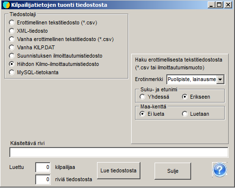

# Ilmoittautumiset IRMA-järjestelmästä

Kansallisen suunnistuskilpailun ilmoittautumiset saadaan normaalisti
tiedostomuodossa IRMA-järjestelmästä.

Ennen ilmoittautumisten siirtoa on hyvä kopioida tiedosto seurat.csv kilpailun kansioon. Tiedosto
löytyy ohjelman demoaineistosta. Jos seuratiedot ovat muuttuneet, on syytä
hankkia tuoreemmat tiedot tai täydentää tiedostoa tekstieditorilla tai Excelillä
uusien tietojen mukaiseksi. Ohjelma käyttää tiedostoa pitkien seuranimien ja
aluekoodien saamiseen osanottajatietoihin IRMAsta saatavien seuralyhenteiden
perusteella.

IRMA:sta saadut tiedot siirretään kilpailuun käyttäen ohjelman valintaa
*Osanottajat / Hae tiedostosta.* Sieltä valitaan *Suunnistuksen
ilmoittautumistiedosto* ja ruksataan kohta *Hae pitkät seuranimet
tiedostosta Seurat.csv*. Sitten haetaan painikkeen *Lue tiedostosta*
kautta IRMA-järjestelmästä haetut tiedot. Jos kaikki on kunnossa, mikä
tarkoittaa erityisesti sitä, että sarjamääritykset ja IRMA:n tiedoissa oleva
sarjat ovat yhdenmukaiset, ilmoittaa ohjelma luettujen kilpailijoiden
määrän.

Jos lukeminen
katkeaa, vaiheessa jossa osa tiedoista on siirtynyt, on estettävä samojen kilpailijoiden tuleminen mukaan useampaan
kertaan joko poistamalla tiedosto KILP.DAT ja aloittamalla alusta tai poistamalla
jo siirtyneet tiedot IRMA:sta saadusta tiedostosta.

Ohjelman valinnassa *Osanottajat / Osanottajat* aukeaa taulukko, jossa
näkyy mitä tietoja on siirtynyt. Jos halutaan vertailua nähdä tiedot
samassa järjestyksessä, missä ne ovat luetussa tiedostossa, valitaan
järjestykseksi *Kirjaus.* Täten voidaan mm. varmistaa kohta, missä
tietojen siirtyminen on katkennut.

Valinnassa *Osanottajat / Seurat ja osanottajamäärät* voi tarkastella
osanottajamääriä jaoteltuina sekä sarjoittain että seuroittain.