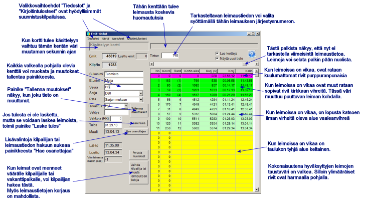
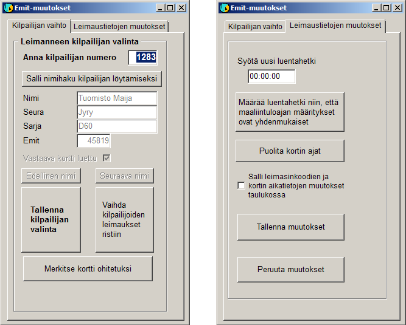

# Leimantarkastus

Kun päävalikosta valitaan *Tulospalvelu /
Emit-luenta* avautuu tämä kaavake

Tässä tarkatellaan leimantarkastustoimintoa
suunnistuskilpailussa. Kuntosuunnistuksissa, joissa osanottajat eivät ole
ennalta Emit-koodeineen osanottajatiedoissa on kaavakkeen käyttötapa vähän
erilainen. Toimintatapaan vaikutetaan ohjelman konfiguroinnilla ja myös
kaavakkeen valinnoista *Näytä* ja *Asetukset*, joita ei yleensä
tarvita suunnistuskilpailuissa.

Kun uusi kortti luetaan, näyttää ohjelma heti sen tiedot
edellyttäen, että kaavakkeella on näkyvillä viimeisimmät tiedot ja ruksit ovat
ruksattuina, kuten yllä. esimerkkitapauksessa ei tietoja näytetttäisi heti,
koska tarkasteltavana on aiempi tietue, mutta tietuenumeron näyttävän kentän
oikealle puolelle tulis näkyviin painike, jota klikkaamalla päästään uuden
tiedon käsittelyyn.

Kun kaikki tiedot ovat kunnossa, ei kaavakkeella
tarvitse tehdä mitään, vaan seuraava kortti voidaan lukea heti. Vasemman
yläkulman taustaväriä vaihtava alue auttaa huomaamaan, että uusi kortti on
luettu silloin, kun tiedot muuttuvat muuten hyvin vähän.

Kun lukijaan tulee kortti, jonka koodia ei ole
yhdelläkään kilpailijalla, avautuu toinen kaavake:

Sama kaavake voidaan avata myös
kaavakkeen *Emit-tiedot* painikkeesta.

Yllä näkyvät muutoskaavakkeen molemmat alisivut.
Yleisemmin tarvitaan vasemmanpuoleista, jolla valitaan osanottaja, jolle leimat
kuuluvat, kun ne ovat kirjautuneet väärälle osanottajalle tai
vakanttitietueelle. Jos oikean kilpailijan numero on tiedossa, on se vain
syötettävä ja vahvistettava painamalla Enter kahdesti. Tällöin ohjelman pitäisi
myös tehdä asianmukainen leimantarkistus ja laskea tulos, ellei kilpailijalla
sitä vielä ole. On kuitenkin varmistettava kaavakkeelta *Emit-tiedot*,
että näin on tapahtunut, koska on tilanteita, joissa ohjelma ei toimenpiteitä
tee.

Ellei numeroa tiedetä, voidaan painikkeen kautta siirtyä
nimihakuun, mikä alkaa kirjoittamalla ainakin alkuosa nimestä ja painamalla
Enter. Sitten voi hakea selailemall aakkosjärjestyksessä. Ruksi kohdassa
*Vastaava kortti luettu* kertoo, että valitulle kilpailijalle on jo
luettu Emit-tiedot, mikä viittaa siihen, että valinta on väärä tai kahden
kilpailijan tiedot ovat menneet ristiin. Viimeksi mainitussa tapauksessa johtaa
oikeanpuoleinen vahvistuspainike tietojen tarvittavaan vaihtoon.

Kaavakkeen toisella alasivulla voidaan vaihtaa kortin
kirjattu luentahetki sekä korjata joskus esiintyvä viallisen kortin
tuottama tilanne, jossa kaikki sen aikaerot ovat kaksinkertaiset. Tämä alasivun
kautta voidaan myös sallia kaavakkeella Emit-tiedot olevan taulukon muokkaus
sarakkeiden *Koodi* ja *Kortin aika* osalta (nämä kaksi saraketta
kertovat suoraan, mitä kortille on tallentunut, muut sarakkeet lasketaan tai
päätellään näiden sarakkeiden tiedoista).

Kortin luentahetken korjaaminen auttaa saamaan väliajat
oikeiksi silloin, kun kortin ensimmäisen luennan epäonnistuminen on tehnyt ne
virheellisiksi. Kilpailussa, jossa ajat on määrätty online-ajanotolla
maalivivalla, antaa lasketun ja todellisen maaliintuloajan yhdenmukaisuus
yleensä oikeat väliajat. Kun tulos on määrätty leimantarkastuksessa voidaan
oikea maaliintuloaikakin joutua arvioimaan.

---

 Copyright 2012 Pekka
Pirilä