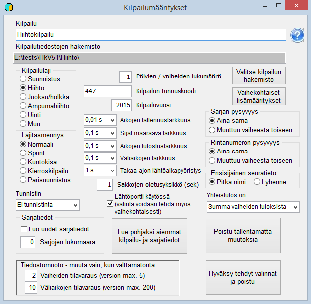

# Perusvalinnat

Ryhdyttäessä perustamaan kilpailua on päätettävä, mihin
kansioon kilpailua koskevat tiedot sijoitetaan. Suositukseni on että kilpailulle
luodaan uusi kansio asennusvaiheessa luodun kansion Kisa alikansioksi. Kansio
voidaan luoda ohjelmalla *HkKisaWin* samalla, kun määritellään muut
perusvalinnat. Toiminta aloitetaan käynnistämällä ohjelma *HkKisaWin* ja
klikkaamalla painikekenttää *Kilpailun luominen ja perusominaisuudet*.
Tällöin avautuu kaavake *Kilpailumääritykset.*

Yleensä säästetään huomattava määrä vaivaa käyttämällä
pohjana jotain aikaisempaa kilpailua. Tässä tapauksessa haetaan pohjaksi
sarjatiedot ohjelman mukana asennetusta esimerkkiaineistosta klikkaamalla
*Lue pohjaksi aiemmat kilpailu- ja sarjatiedot* ja avaamalla tiedosto
KilpSrj.xml ohjelmaa asennettaessa syntyneestä
kansiosta Kisa.

Seuraavaksi klikataan *Valitse kilpailun
hakemisto* ja siirrytään kilpailulle varattuun kansioon tai luodaan tämä
kansio käyttäen dialogi-ikkunan kansion luomistoimintoa. Kun valinta hyväksytään
luo ohjelma tyhjän tiedoston ilmoitt.cfg ja tallentaa sen valittuun kansioon.

Kilpailulle on syytä antaa sopiva otsikko sekä
tunnuskoodi, joka voi olla esimerkiksi Suunnistusliiton IRMA-järjestelmässä
käytettävä numerokoodi. Muut valinnat ovat automaattisesti 1-vaiheiselle
suunnistuskilpailulle sopivat: käytössä on Emit-kortti, ajanottotarkkuus on 1 s,
seuranimistä käytetään ensisijaisena lyhennettä, kuten IRMA:ssa ja sakkojen
oletusyksikkö on 600 s. Sekä sarja että rintanumero ovat
aina samat eli samat kilpailijan perustiedoissa ja käytössä
olevassa ainoassa kilpailuvaiheessa.

Kun kaavakkeelta poistutaan hyväksyen tehdyt valinnat,
tallentuu määritykset sisältyvä tiedosto KilpSrj.xml
kilpailun kansioon. Samalla syntyy vielä tyhjä tiedosto laskenta.cfg.

Kun perusominaisuudet on näin valittu, voidaan kilpailu
avata esivalmisteluun klikkaamalla näin nimettyä painikenttää ja avaamalla ilmoitt.cfg. Tällöin ohjelma ilmoittaa, että tiedostoa KILP.DAT
ei ole
ja luo sellaisen.

---

 Copyright 2012 Pekka
Pirilä