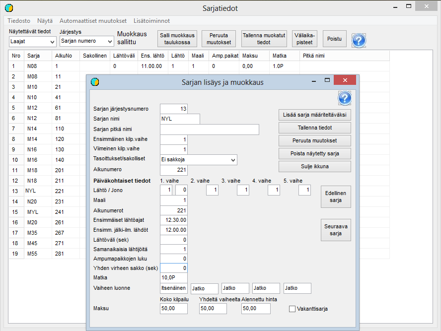

# Sarjatiedot

Perusvalmistelun toinen vaihe on sarjatietojen muokkaaminen kilpailun
vaatimusten mukaisiksi. Tähän vaiheeseen siirrytään valitsemalla valikosta
*Valmistelu / Sarjatiedot.* Sarjatietoja voidaan tarkastella ja muokata
sekä tällä kaavakkeella että sarja kerrallaan kaavakkeella, joka aukeaa
klikkaamalla jotain sarjaa taulukossa.

Esimerkiksi on yllä avattu rastireittisarja, koska se
sisältää valintoja, jotka eivät ole oikein kaikissa pohjatiedoissa.
Rastireittisarjan kohdalla on valittava kuvan mukaisesti
*Rastireittisakot,* jolloin samalla tulee sakon suuruus 600 kenttään
*Yhden vaiheen sakko.* Ellei tätä lukua näy, vaikka valinta on jo tehty
riittää sanan *Rastireittisakot* klikkaminen edellyttäen, että kilpailua
perustettaessa on jätetty luku 600 sakkoyksikön kooksi. Kun tiedot
ovat muuttuneet, on ne tallennettava, jolloin ne tulevat soveltuvilta
osin näkyviin myös taulukossa.

Tässä vaiheessa on olennaista vain, että kaikki
sarjat, joihin tulee ilmoittautumisia, on määritelty ja
nimetty täsmälleen samalla tavalla kuin ilmoittautumistiedoissa. Muut tiedot voidaan
täsmentää, kun siirrytään arvontaan.

Kilpailuun sisältyvien sarjojen lisäksi on hyvä määritellä
erillinen sarja vakanttitietueille. Muutama
ennalta määritelty vakantti helpottaa poikkeustilanteiden hoitaimista luettaessa
Emit-kortteja leimantarkastuksessa. Tällaisia poikkeustilanteita voi syntyä mm. väärin ilmoitetuista
Emit-koodeista sekä viallisista Emit-korteista.

Sarjojen lisääminen ja poistaminen onnistuu vain yhden
sarjan kaavakkeella. Lisääminen aloitetaan klikkamalla *Lisää sarja
määriteltäväksi.* Tämän jälkeen täytetään tarvittavat tiedot ja annetaan
sarjalle järjestysnumero siten, että se asettuu
oikealle paikalle sarjaluetteloon. Kun sarja sitten tallennetaan, kasvatetaan tätä
numeroa myöhempien sarjojen järjestysnumeroita.

Monia muita tietoja voi muokata sekä sarja kerrallaan
että taulukossa, jossa voi tehdä useita muutoksia ennen niiden tallentamista. Taulukko on
erityisen hyödyllinen, kun määritetään sarjojen lähtöaikoja ja numeroinnin alkuarvoja.
Tähän palataan arvonnan yhteydessä.

---

 Copyright 2012 Pekka
Pirilä