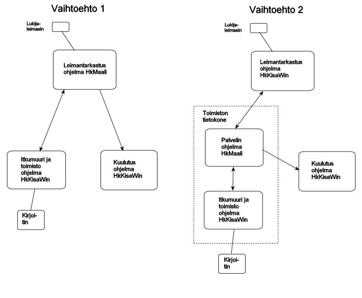

# Tietokoneiden tehtävät

Kansallisessa suunnistuskilpailussa on kilpailun aikana hoidettava
tyypillisesti seuraavia tehtäviä:

- leimantarkastus, joka tuottaa myös tulokset
  maaliviivalla otetun leiman perusteella- itkumuuri, jossa käsitellään tapaukset, joissa
    leimoja ei suoraan hyväksytä- tulosluetteloiden kirjoittaminen, mikä tapahtuu kisan
      aikana automaattisesti pian sen jälkeen, kun sarjan tilanne on muuttunut- ei-lähteneiden merkitseminen, kun näistä on saatu
        tieto lähtöapaikalta- erikseen tulostettavat tulosluettelot mm.
          palkinojenjakoa varten- vaihtelevat korjaukset kilpailijatietoihin- korjaukset ratatietoihin, jos niissä on virheitä tai
              joku leimasin lakkaa toimimasta- kuuluttajan tuki- yhteydet eri tietokoneiden välillä, mikä tapahtuu normaalisti niin, että
                  yksi kone on "palvelimena", johon muut tietokoneet ovat yhteydessä.

Näiden tehtävien hoitamiseen tarvitaan vähintään kolme tietokonetta:

1. leimantarkastuksen kone- itkumuurin ja muiden muutosten kirjauskone,
     jolla tehdään myös muut erillistehtävät- kuuluttajan kone

Suosittelen käyttämään ohjelmaa HkMaali ainakin yhdellä koneella, kunnes
ohjelmasta HkKisaWin on saatu niin paljon kokemusta, että sen toimintavarmuuteen
voidaan täysin luottaa. Jos kaikki eri tehtävät halutaan hoitaa ohjelmalla
HkKisaWin, edellyttää tämä joko yhtä lisätietokonetta tai sitä, että yhdellä
koneella ovat käytössä molemmat ohjelmat. Ohjelma HKMaali toimii tällöin mm.
tiedonsiirron solmukoneena eli "palvelimena".

Toiminnoista leimatarkastus voidaan hoitaa sekä ohjelmalla HkMaali että
ohjelmalla HkKisaWin. Ensin mainitussa tapauksessa voi leimantarkastuksen kone
toimia palvelimena, jälkimmäisessä voidaan toimiston koneella pitää käynnissä
molempia ohjelmia, toista palvelimena ja toista niiden toimintojen
suorittamiseen, joihin HkKisaWin sopii paremmin.

Käyttöliittymä on
ohjelmassa HkKisaWin jo nyt parempi ja kehittyy jatkuvasti.
Siksi suosittelen nyt ensijaisesti vaihtoehtoa 2 ja esitän
jäljempänä konfiguraatiotiedostot sille sopivassa muodossa.

---

 Copyright 2012 Pekka
Pirilä