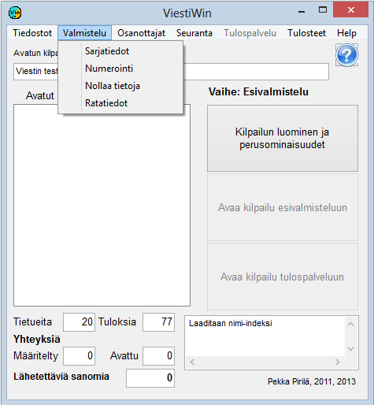

# 1.3.2 Valinta: Valmistelu

Valinnan *Valmistelu* kautta siirrytään toimintoihin, joita tehdä
ennen itse tulospalveluvaihetta sekä luotaessa päättyneen vaiheen perusteella
seuraavaa vaihetta kuten karsinnan perusteella loppukilpailua. Suunnistuksen
ratatietoja voidaan muuttaa myös käynnissä olevan vaiheen osalta.

Osa valinnoista on estetty, kun valittu toimintatila tekee niiden käytön
mahdottomaksi tai ei-toivotuksi.

- **Sarjatiedot.** Avaa taulukko
  sarjamääritysten tarkastelemiseksi ja muokkaamiseksi. Avattavan taulukon
  kautta voidaan avata edelleen väliaikapisteiden määrittely sekä yksittäistä
  sarjaa käsittelevä kaavake.

  - **Numerointi.**
    Kilpailun arvonta mm. partiosuunnistuksessa ja osanottajien numeroiden
    antaminen.

    - **Nollaa tietoja.** Tulosten ja
      joidenkin muiden tietojen nollaus. Mahdollista vain
      esivalmistelutilassa.

      - **Ratatiedot.** Suunnistuksen
        ratatietojen määrittely ja muokkaus. Muokkaus mahdollista myös käynnissä
        olevan vaiheen tiedoille.

---

 Copyright 2012, 2015 Pekka
Pirilä