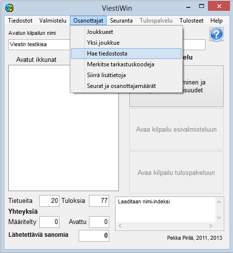

# 1.3.3 Valinta: Osanottajat

Päävalikon valinnasta *Osanottajat* käynnistetään osanottajiin
liittyviä toimintoja, joita voidaan pääosin käyttää sekä esivalmistelussa että
tulospalvelutilassa.

- **Joukkueet.**
  Taulukko osanottajatietojen tarkasteluun ja muokkaamiseen. Taulukosta
  pääsee klikkaamalla edelleen yksittäisen joukkueen tietojen
  kaavakkeelle, jolla myös syötetään uusia
  joukkueita.

  - **Näytä maastossa olevat kilpailijat.** Taulukko
    osuuksittain kilpailijoista, joilla on emit-numero ja lähtöaika, mutta
    ei maaliaikaa kyseisellä osuudella, ja joita ei ole merkitty
    poissaoleviksi, ei-lähteneiksi, vakanteiksi, keskeyttäneiksi tai
    hylätyiksi. Jos edellinen osuus on suljettu ja seuraavalla osuudella
    on emit, rivi näytetään vaikka lähtöaika ei tulisikaan vaihdosta.
    Sarakkeina ovat lähtöpaikka, lähtöaika ja kaikki käytössä olevat
    väliaikapisteet. Listaa voi rajata sarjan mukaan. Painike *Hae*
    päivittää näytön.

  - **Yksi joukkue.** Suora linkki yhden
    joukkueen tietojen kaavakkeelle.

    - **Hae tiedostosta.**
      Osanottajatietojen lukeminen tekstitiedostoista, kuten suunnistuksen
      IRMA-järjestelmän ja hiihdon KILMO-järjestelmän tuottamista tiedoista sekä
      ohjelman itse tekemistä siirtotiedostoista. Haku on mahdollista myös
      MySQL-tietokannasta sekä eräistä aiempien ohjelmien tuottamista
      tiedostomuodoista.- **Merkitse tarkastuskoodeja.** Käytetään mm. merkinnän ei-lähtenyt tekemiseen pois
        jääneille kilpailijoille.- **Siirrä lisätietoja.** Monia eri
          tapoja siirtää kilpailijoiden tietoja kentästä toiseen joko ilman ohjaavaa
          tiedostoa tai tekstitiedostossa olevien taulukkomaisten tietojen mukaisesti.
          Käytetään mm. rankipisteiden siirtämiseen kilpailijoille arvontaa
          varten.

          - **Seurat ja osanottajamäärät.** Taulukoista, joista ilmenee sarjojen
            osanottajamääriä ja kustakin seurasta osallistuvien määriä. Myös
            seuraluettelon tulostus.