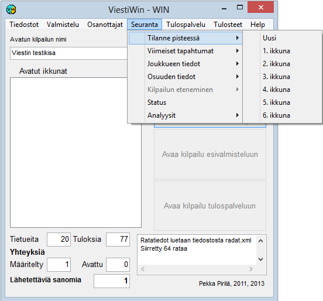

# 1.3.4 Valinta: Seuranta

Valinnan *Seuranta* kautta voidaan avata monia
erilaisia seurantaikkunoista jotka soveltuvat mm. kuuluttajan käyttöön. Monista
ikkunatyypeistä voidaan avata useita kopioita, jotta olisi mahdollista seurata
useiden sarjojen tai useiden kilpailijoiden tilannetta. Monilta ikkunoilta voi
myös edetä lisää yksityiskohtia kertoville kaavakkeille klikkaamalla tähän
liittyviä painikkeita tai taulukkojen rivejä.

- **Tilanne pisteessä.** Vie taulukkomaiselle
  kaavakkeelle, joka näyttää valittavan sarjan tilanteen valittavassa
  pisteessä.

  - **Viimeiset tapahtumat.** Tuo esille
    taulukon, josta näkyvät viimeisimmät uudet tiedot joko kaikkiaan tai valitussa
    pisteessä.

    - **Joukkueen tiedot.**
      Näyttää joukkuetta koskevat
      tiedot. (Sama kaavake kuin osanottajavalinnan kautta, mutta estäen
      muokkauksen.

      - **Osuuden tiedot.** Näyttää mm. yksittäisen kilpailijan tiedot ja
        mm emit-leimoista lasketut väliajat.

        - **Status.** Tietoa
          eri sarjojen tulosten ja hylättyjen lukumääristä, tiedonsiirtoyhteyksistä sekä
          automaattisen tulostuksen tilanteesta.- **Analyysit
            / Emit-analyysit.** Kilpailijoiden emit-väliaikojen vertailu.
            (Tilapäisesti
            poistettu käytöstä)

            - **Analyysit / Yhteenveto.** Taulukkotietoa emit-väliajoista. (Tilapäisesti poistettu
              käytöstä)

---

 Copyright 2012, 2015 Pekka
Pirilä