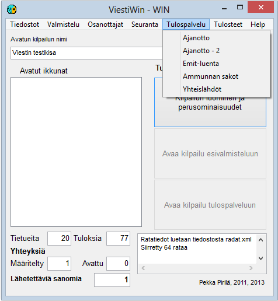

# 1.3.5 Valinta: Tulospalvelu

Valinnasta *Tulospalvelu* siirrytään ajantoton
sekä leimantarkastuksen toimintoihin. Tästä valinnasta pääsee myös pisteiden
laskentaan tulosten perusteella kilpailun loppuvaiheessa sekä muuttamaan
sarjoittain lähtöaikoja, jos kilpailun aikataulu on muuttunut.

**

- **Ajanotto, Ajanotto - 2.** Kaavake ajanoton seurantaan. Mahdollisuus
  seurata kahta eri ajanottotaulukkoa. (Ei vielä
  toteutettu)

  - **Emit-luenta.** Emit-leimantarkastus,
    joka voi sisältää myös tulosten laskennan.

    - **Sisäänluenta (emit)**. Tämä valinta
      on käyetttävissä, kun ohjelma on käynnistetty antaen parametri SISÄÄNLUENTA.
      Valinnan kautta päästään Emit-koodien tallennustoimintoon, jota
      käytetään kilpailijoiden siirtyessä lähtö- tai vaihtoalueelle.

      - **Yhteislähdöt.** Yhteislähtöjä koskevat
        määritykset.- **Ammunnan sakot.**
          Tässä valinnassa voidaan syöttää ohilaukausten määrät sekä seurata
          Kurosen laitteistolta saatuja tieoja
          ohilaukauksista.

Kulloinkin näkyvillä olevat vaihtoehdot vaihtelevat
lajin ja käynnistysparametrien
mukaan.