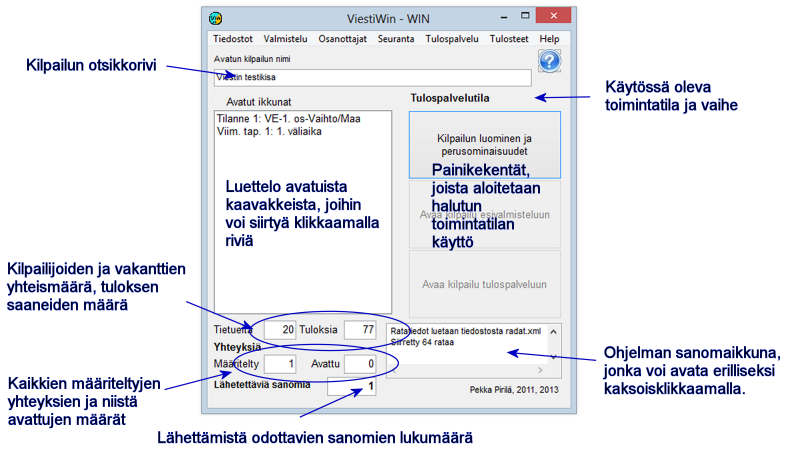

# 1.3 Ohjelman pääkaavake

Ohjelman pääkaavakkeen valikoista päästään suoraan useimpiin
toimintoihin. Lisäksi on muutamia toimintoja, joihin edetään tästä avattavien
kaavakkeiden kautta. Seuraavilla sivuilla esitellään lyhyesti valikon vaihtoehtojen
käyttökohteet.

Toimintoon *Kilpailun luominen ja
perusominaisuudet* voi siirtyä
sekä suoraan ohjelman käynnistyttyä että kummastakin muusta toimintatilasta.
Esivalmistelun ja tulospalvelutilan välillä tai vaiheesta toiseen ei voi siirtyä
poistumatta välillä koko ohjelmasta.

Kaavakkeen alareunassa näkyvät tiedot yhteyksien lukumääristä sekä lähettämistä
odottavien sanomien lukumääristä kertovat tiedonsiirron tilasta. Lähetettävien
sanomien lukumäärän kasvu kertoo, että joku määritellyistä yhteyksistä ei toimi.