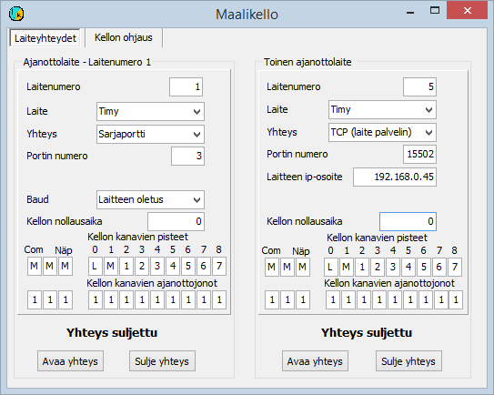

# 5.2  Maalikellon käyttö

### 5.2  Maalikellon käyttö

Maalikellojen käyttö kannattaa yleensä valmistella
ennalta ja valinnat tallentaa konfiguraatiotiedostoon. Erityisesti
testailuvaiheessa ja tilanteen muuttuessa kilpailun aikana voi kuitekin olla
käytännöllisempää muuttaa valintoja valikon kautta. Tätä käsitellään alla
kohdassa 5.2.2.

#### 5.2.1 Maalikellot ja niiden käyttöönotto konfiguraatiotiedoston avulla

Ohjelmat tukevat useita mallikelloja. Näitä ovat

- Alge-Timingin valmistamat Timy, S3, S4 ja Comet.

  - Emitin (aiemmin Regnly) RTR1, RTR2, ECB1 ja ETS1.

Lisäksi on ohjelmistoon toteutettu myös harvinaisempien laitteiden tukea,
jota ei kuitenkaan ole jatkuvasti ylläpidetty.

Maalikelloja käytetään valtaosin vain ajan ottamiseen siten, että tieto
kilpailijasta syötetään käsin tai joissain tapaukissa saadaan tunnistimesta joko
maalikellon tai erillisen laitteen kautta. Muissa alaluvuissa käsitellään
menettelyjä, joissa tunnistaminen liittyy osaksi samaa tapahtumaa kuin
ajanotto.

Ohjelma tallentaa ajat yksiköissä 1/10000 s, mutta viimeinen desimaali ei
yleensä sisällä todellista ajanottotietoa. Tällöin se voi auttaa pitämällä ajat
kiinteässä järjestyksessä, vaikka ne ovat millisekunnin tarkkuudella samat.

Maalikello liitetään ohjelmaan yleensä sarjaportin kautta, mutta Timy on
mahdollista liittää myös yhdistämällä USB- ja TCP-yhteydet, kuten liitteessä 7
kuvataan. Tietokoneen sarjaportti on nykyisin toteutettu usein USB/RS232
-muuntimella. Jotkut laitteet saattavat sisältää tällaisen muuntimen, jolloin
käytettävä kaapeli on USB-kaapeli, mutta liitäntä ohjelman kannalta silti
sarjaportti. Maalikellon tyyppi sekä sarjaportin numero kerrotaan
konfiguraatioparametrilla, joka voi olla esimerkiksi

TIMY= 7

kun kello on Timy ja USB-muuntimen tarjoama sarjaportti COM7.

**Ajanoton kohdepisteen määräytyminen**

1. Perusoletuksena on, että kaikki ajat koskevat vaihtoja ja maalia

   - Kaikkien aikojen oletus voidaan vaihtaa toiseksi
     parametrilla PISTE

     - Piste voidaan määrätä maalikellon
       ajanottoliitännästä parametrin PISTEET

       - Kun ajat ohjataan useaan jonoon, voidaan kullekin
         jonolle määritellä oletuspiste parametrilla JONOPISTE

         - Piste voidaan jättää pääteltäväksi kilpailijan aiemmin saamista ajoista
           joko kaikissa tapauksissa tai edellä mainittujen parametrien tarkemmin rajaamissa tapauksissa.

**Kaikkien aikojen pisteen määrittely**

Esimerkiksi parametri

PISTE=1

kertoo, että kaikki ajat
tulevat osuuden ensimmäisestä väliaikapisteestä. Numeron 1 paikalla voi olla seuraavat merkit

A = piste määrätään
myöhemmin  
L = lähtö (harvinainen viestin ohjelmaa
käytettäessä, mutta joskus käytössä)  
M = maali tai
vaihto  
1, 2, .., 9 =
numeroarvon kertoma osuuden väliaikapiste

**Pisteen määrääminen maalikellon liitännän
mukaan**

Useimmat maalikellot pystyvät kertomaan ajanottopistettä
koskevan tiedon. Tämän tiedon tulkintaa ohjataan parametrilla, joka on muotoa

PISTEET=AMMLM123

Yhtäsuuruusmerkkiä seuraavan merkkijonon kirjaimet ja
numerot liittyvät järjestyksessä seuraaviin ajanottotapoihin

- Sarjaporttiin liitetty painike

  - Varalla (aiempi käyttö poistunut)

    - Tietokoneen näppäimistön painike

      - Maalikellon lähtöporttiliitäntä tai painike

        - Maalikellon maaliliitäntä tai painike

          - Maalikellon 1. väliaikaliitäntä

            - Maalikellon 2. väliaikaliitäntä

              - ..

Merkkijonon merkit tuottavat saman merkin tietokoneen
näytölle kertoen siten, onko käyttökohde avoin ja tulkittava vai liitetty
tiettyyn pisteeseen. Jos väliaikapisteen järjestysnumer on 10 tai suurempi, on
jokainen merkki erotettava muista pilkulla. Merkkijonossa on siis heti
ensimmäisen tunnusmerkin jälkeen oltava pilkku.

**Ajanottojonojen käyttö**

Ajat voidaan ohjata useisiin eri jonoihin käyttäen parametria

JONOT=1112134

mikä ohjaa parametrin PISTEET tapaan, mutta nyt eri jonoihin. Edellä
mainittujen parametrien yhdistelmä ohjaa lähtöajat jonoon 2, maalin ajat jonoon
1 ja väliajat jonoihin 3 ja 4.

Eri jonoille voidaan määritellä ajanottopiste tai
pisteen määräytymistapa parametrillaJONOPISTE. Esimerkiksi

JONOPISTE2=A

kertoo, että toiseen jonoon tallentuville ajoille
käytetään pisteen myöhempää määräytymistä. Jokaiselle jonolle voidaan siis
antaa eri
käyttötarkoitus.

**Pisteen automaattinen määräytyminen**

Kun piste ei määräydy suoraan edellä kuvatulla tavalla,
vaan on jätetty myöhemmin määrättäväksi, on yleensä käytössä pisteen
automaattinen määräytyminen aiempien tulosten perusteella vuodossa olevaksi
pisteeksi. Ossus määräytyy ensimmäiseksi, jolta ei vielä ole loppuaikaa ja piste
viimeisintä aiemmin otettua aikaa seuraavaksi
pisteeksi.

Jos ohjelmalle on annettu
parametri

VAINVÄLIAJAT

ei ohjelma anna väliaikojen täytyttyä maalin tai vaihdon
aikaa, vaan merkitsee pisteeksi väliaikapisteiden lukumäärää seuraavan arvon.
Tällöin aika ei kirjaudu kilpailijalle, mutta näkyy
ajanottotiedoissa.

#### 5.2.2 Maalikellon käyttöä koskevat valinnat määrittelykaavakkeilla

(Kuva on ohjelmasta HkKisaWin. ViestiWin ei tue kahta
ajanottolaitetta)

Tällä kaavakkeella ei näytetä Emit-laitteita koskevia
tietoja, joille on oma kaavakkeensa ([luku 6.6](6.10_mtr-_ja_emitag-laitteiden_ohjaus.md)
).

Tässä käsitellään maalikelloja, joiden toiminta ei
perustu tunnisteen havaitsemiseen. Emitin ECB1 ja ETS1 koskevat valinnat tehdään
Emit-laitteiden määrittelykaavakkeilla.

Seuraava kuvaus koskee valtaosin sekä ajanottokaavakkeen
valikon kautta avattua kaavaketta että [konfiguraatioeditorin](1.3_toimintatilojen_konfigurointi.md)
vastaavia valintoja.

Maalikellot toimivat laitteena no 1. Samanaikaisesti ei mikään
muu laite voi olla laitteena 1. Laitteen määrittely alkaa
valitsemalla maalikellon tyyppi.

Kaikkien kellojen normaali liitäntätapa ohjelmaan on
sarjaportti, mutta Timy voidaan liittää tietokoneeseen myös suoraan
USB-yhteydellä, joka ei perustu sarjaporttisovittimeen. Tällöin Timy on
yhteydessä erilliseen ohjelmaan, joka lähettää tiedot tulospalveluohjelmalle
TCP-protokollaa käyttäen toimien TCP-palvelimena. Myös maalikellon kaltaisesti
toimivat emulaattoriohjelmani pystyvät lähettämään tietoja myös TCP-yhteden
kautta. Näitä käyttötapoja varten on tarjolla mahdollisuus valita yhteysmuodoksi
TCP.

Sarjaporttia käytettäessä määritellään edelleen sarjaportin numero.
Tiedonsiirtonopeus on yleensä laitteen oletuksen mukainen, Timyn tapauksessa 9600 baud, mikä on
valittava Timyn valikkojen kautta, jos se ei ole valmiiksi valittuna. On
kuitenkin mahdollista valita myös, että ohjelma käyttää poikkeavaa sarjaportin
nopeutta.

TCP-yhteyttä käytettäessä toimii kello tai ulkoinen
tietokoneohjlma normaalisti palvelimena, jolloin ohjelman HkKisaWin
määrityksissä on annettava laitteen IP-osoite sekä yhteydenottoportti.

Määrittelyihin sisältyy vielä mahdollisuus määritellä
kellonaikapoikkeama, jos maalikello ei antaa paikallisajasta poikkeavia aikoja.
Poikkeama ilmaistaan kellonaikana, jolloin maalikellon aika oli tai olisi ollut
00:00:00.

Kaavakkeella voidaan määritellä myös minkä pisteen aikoja
maalikellon eri kanavat sekä muut ajanottotavat antavat ja mihin
ajanottojonoon nämä ajat ohjautuvat.