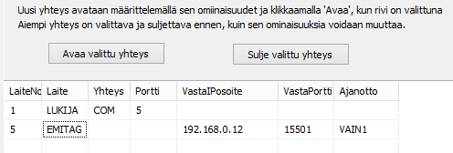

# 6.6 Yhteydet Emit-lukijaan, MTR- ja emiTag-laitteiden ohjaus

### 6.6 Yhteydet Emit-lukijaan, MTR- ja emiTag-laitteiden ohjaus

Kun käytössä on MTR-laite tai emiTag-järjestelmän laite, voi
leimantarkastuskaavakkeen ja ajanottokaavakkeen valikosta valita toiminnaksi kyseisen laitteen
ohjauksen. Näin avautuvalla kaavakkeella voi pyytää tietojen lähettämistä
laitteen muistista, asettaa laitteen kellon samaan aikaan tietokoneen kanssa
sekä antaa laitekohtaisia ohjauskomentoja. Käytettävien komentojen merkitys
selviää kyseisen laitteen dokumentaatiosta.

emiTag-laitteiden käyttöä käsitellään lähemmin [liitteessä 5](liite_5._emitag-laitteiden_kaytto.md) .

MTR- ja emiTag-laitteet tallentavat luettuja tietoja
muistiinsa. Ohjelma voi hakea jälkikäteen näitä tietoja joko suoraan
käsiteltäviksi tai lukea niitä erilliseen tiedostoon. Kun tietoja haetaan
erilliseen tiedostoon, voidaan leimantarkastuskaavakkeen valinnassa *Lue tietoja tiedostosta* valita, mitkä tiedoista otetaan
varsinaiseen käsittelyyn.

Yhteydet Emit-laitteisiin määritellään yleensä ennalta
konfiguraatiotiedostoa käyttäen, mutta yhteys laitteeseen on mahdollista avata
ja sulkea myös ohjelman HkKisaWin valikon kautta. Tämä soveltuu ennakoimattomiin
erityistarpeisiin, testailuun sekä käytettävän yhteyden vaihtamiseen esimerkiksi
tilanteessa, jossa sarjaporttimuunnin lakkaa toimimasta alkuperäisessä
USB-portissa, mutta saadaan toimimaan toisen USB-portin kautta.

Emit-laitteen yhteys määritellään sekä [konfiguraatioeditorissa](1.3_toimintatilojen_konfigurointi.md)
että käytön aikana leimantarkastuskaavakkeen valikon kautta avattavalla
kaavakkeella hyvin samankaltaisesti.

Kaavakkeen yhteystaulukkoon merkitään ensimmäiseen
sarakkeeseen laitteen numero, jonka maksimiarvo voi vaihdella, ja on nyt 32.
Laitteen numero ei saa olla sama kuin toisella laitteella. Maalikello ei siis
voi käyttää samaa numeroa kuin lukijalaitte.

Muut tiedot valitaan osittain klikkaamalla asianomaista
ruutua hiiren oikealla näppäimellä.

- Sarakkeeseen 2 voidaan valita lukija,
  emiTag-laite tai MTR (MTR5 toimii emiTag-laitteena).

  - Sarakkeeseen 3 valitaan joko sarjaportti tai
    IP-yhteys, jolle on kolme vaihtoehtoa.

    - Sarakkeeseen 4 kirjoitetaan tietokoneen sarjaportti
      sarjaporttiyhteyden tapauksessa ja ip-portti, kun laitteen oma ip-portti on
      kerrottava

      - Sarakkeeseen 5 kirjoitetaan laitteen ip-osoite, jos
        ohjelman pitää ottaa yhteys palvelimena toimivaan laitteeseen

        - Sarakkeeseen 6 kirjoittaan sarakkeen 5
          ip-osoitteeseen liittyvä portti.

          - Sarakkeeseen 7 valitaan hiiren
            avulla mahdollisia ajanottotoiminnan valintoja.

Yllä olevassa alueessa on valittu ylemmällä rivillä
tyypillinen yhteys Emit-lukijaan. Alempi rivi kertoo, että yhteys
emiTag-laitteeseen otetaan TCP-protokollaa käyttäen. Ohjelma pyytää yhteyttä
osoitteesta 192.168.0.12:15501. Tätä yhteyttä käytetään ajanottoon niin, että
ajat menevät ensimmäiseksi väliajaksi. (Nämä kaksi riviä eivät toimi ongelmitta
yhdessä.)